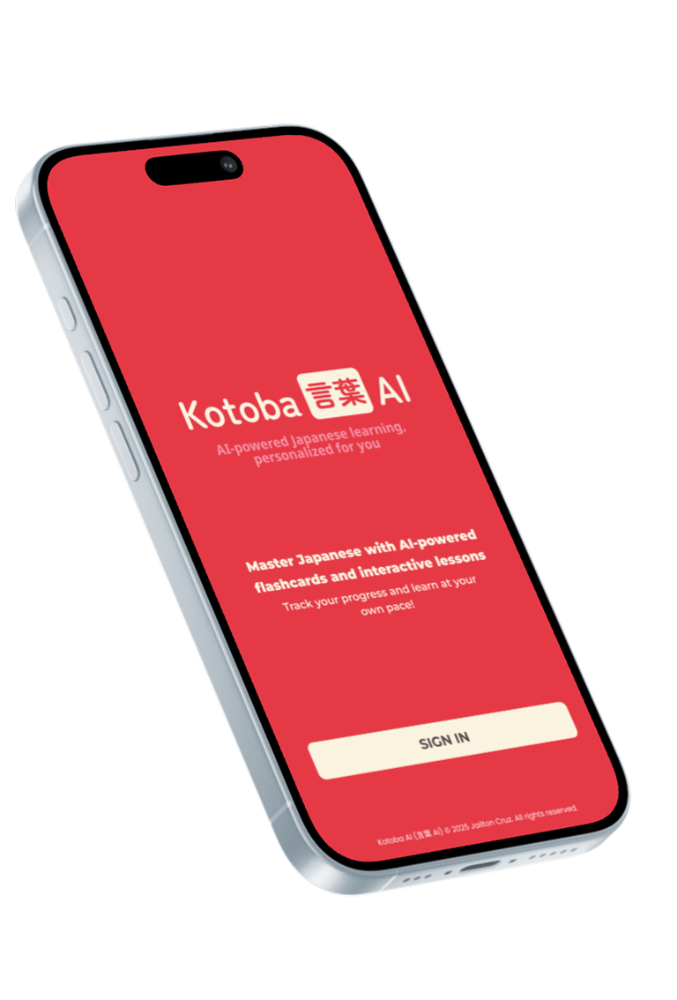

# Kotoba AI

  

Kotoba AI is an AI-powered flashcard application designed to help users memorize and practice Japanese effectively. It adapts to the user's learning progress and introduces new words, phrases, and grammar based on proficiency levels.

## Features

- **Adaptive Learning**

  - Suggests basic words in hiragana (2-3 characters) and increases complexity as the user improves.
  - Uses a **Spaced Repetition System (SRS)** to optimize word retention.

- **AI-Generated Lessons**

  - Users can generate lessons based on selected subjects and contexts.
  - Clicking on a Japanese word adds it to the user’s deck for later study.

- **Flashcard System**

  - Displays Japanese words with romaji, pronunciation, and meanings.
  - Includes an **audio feature** to help with pronunciation.

- **Modern UI/UX**

  - Built with **React (Vite SPA)** for the frontend and **NestJS** for the backend.
  - Styled with **Tailwind CSS** and **Radix UI**.
  - Uses a **Japanese-inspired color palette**:
    - **Primary:** Vermilion Red (#E63946)
    - **Accent:** Sakura Pink (#F697AA)
    - **Background:** Off-White (#FAF3E0) / Deep Navy (#1B1F3B)

- **User Authentication & Data Storage**
  - Secure user authentication via email.
  - Prisma ORM for database management.

## Tech Stack

- **Frontend:** React (Vite), Tailwind CSS, Radix UI
- **Backend:** NestJS, Prisma ORM
- **AI Integration:** OpenAI API for generating flashcards and lessons
- **Database:** PostgreSQL

## Roadmap

- [ ] Improve the AI-generated lessons with more contextual grammar hints.
- [ ] Add N3-level vocabulary and grammar explanations.
- [ ] Implement a leaderboard and gamification features.
- [ ] Mobile-friendly design improvements.

---

**Kotoba AI** is built to make learning Japanese engaging, personalized, and efficient. 🚀
